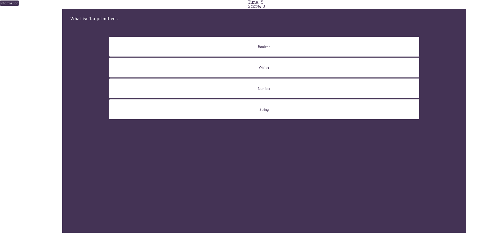

# JS quiz game

Module 4 Challenge to create an application that creates a looping quiz game on javascript.

## Features

- Local storage keeping track of past scores.
- Toggable Information.
- Game Loop with replay support without page reload.
- Flex Layout

## Roadmap

- Better css
